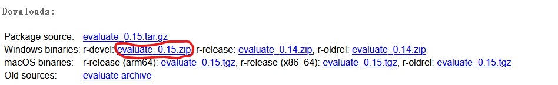
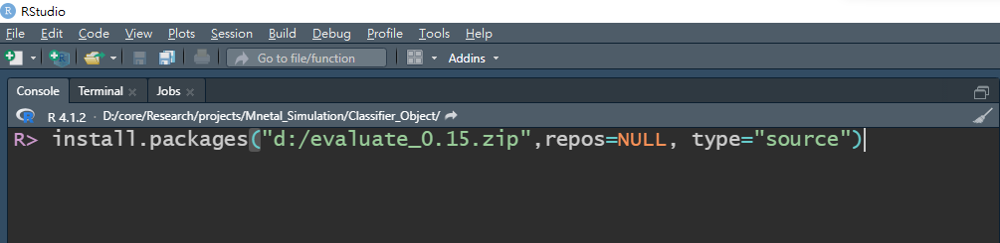
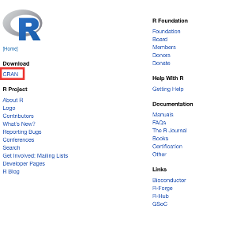

## Windows 7,8,10,11

### 無法安裝R與Rstudio

- 確認你安裝的作業系統是專業版，家用版無法安裝未經微軟認證的開源軟體。
- 參考[官方說明](https://support.microsoft.com/zh-tw/windows/%E6%88%91%E6%AD%A3%E5%9C%A8%E5%9F%B7%E8%A1%8C%E5%93%AA%E5%80%8B%E7%89%88%E6%9C%AC%E7%9A%84-windows-%E4%BD%9C%E6%A5%AD%E7%B3%BB%E7%B5%B1-628bec99-476a-2c13-5296-9dd081cdd808#WindowsVersion=Windows_11)查看個人使用的作業系統版本。

### 無法安裝R套件

- **問題描述** 依預設建議安裝windows 10與11，會綁定onedrive。或預設登入權限不具有管理員等級，無法更改外部軟體安裝路徑，都會造成在R console無法透過遠端伺服器下載安裝所需套件。

- 解決方法1: R與Rstudio不要安裝於"C:\\Program Files"。有兩個以上磁碟區，建議安裝於"C:\\"之外的磁碟區。只有一個磁碟區，建議安裝於其他非"C:\\Program Files"的路徑。

- 解決方法2:(適用解決方法1無法解決者) 自行下載套件壓縮檔，由本地安裝。

> step 1. 下載套件壓縮檔。以`evaluate`為例，google搜尋"R evaluate package"可找到[CRAN資訊網頁](https://cran.r-project.org/web/packages/evaluate/index.html)。從網頁中下載最新版壓縮檔。

> step 2. 存放於可讀寫的路徑，例如 D:\

> step 3. 在“Console"畫面執行安裝函式，如下圖示範。

## Mac OS

### 安裝package遇到無法make的訊息

- 請依個人硬體條件，將作業系統升級至最新版本。許多R Package需要搭配作業系統才能安裝或升級。

### 安裝R

1. 至官方網站下載：https://www.r-project.org/
2. 點選選單左側：CRAN

3. 選擇Taiwan 
4. 選擇Download R for macOS
5. 選擇適合自己mac系統^*的載點（例如：catalina、big sur），按照步驟安裝。

^* Mac OS可由桌面左上角蘋果圖示，點選：”關於這台mac”以確認系統規格。

### 安裝Rstudio

1. 前往 Rstudio下載的網址：https://www.rstudio.com/products/rstudio/

2. 點選：Rstudio Desktop

3. 點選：Download Rstudio Desktop，依照電腦指示安裝。

