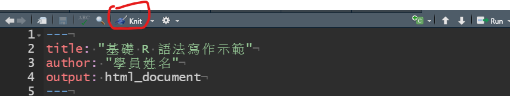

```{r setup, include=FALSE}
knitr::opts_chunk$set(echo = FALSE)

# Learn more about creating websites with Distill at:
# https://rstudio.github.io/distill/website.html

# Learn more about publishing to GitHub Pages at:
# https://rstudio.github.io/distill/publish_website.html#github-pages

```


### 可重製統計學習前準備

- 請自備能執行R與Rstudio的個人電腦設備，作業系統不拘，安裝設定請參考影片：

**Windows使用者務必安裝R與Rstudio於"C:\\Program Files"之外的路徑**<br>

**Mac OS使用者請確認作業系統版本維持於最新版**<br>

<iframe width="560" height="315" src="https://www.youtube.com/embed/TRQbovHGLQk" title="YouTube video player" frameborder="0" allow="accelerometer; autoplay; clipboard-write; encrypted-media; gyroscope; picture-in-picture" allowfullscreen></iframe>

### 初步安裝者自行測試指引

1. 初步安裝完成者請自行下載[基礎 R 語法寫作示範](https://rstat-project.github.io/seed_courses/base_R_demo.zip)

2. 解壓縮後以Rstudio開啟"base_R_demo.Rmd"

3. 按下視窗上方的"Knit"按鈕，能生成網頁檔"base_R_demo.html"表示你的R及Rstudio可正常執行。(過程中將安裝必要套件，提示按yes或繼續即可)



<!---

### 開放學習資源清單

> 清點中

2022/2/16 blocked 
> leve 1與level 2電子書為本課程主要學習材料，修課學生可參考[課程大綱](syllabus.html)依單元順序學習。有github帳號者皆可在課程討論區發言。“可重製統計中文示範系列”是再進階的學習材料，提供更熟練R與資料科學方法的同學自修。


- [psyteachr undergraduate level 1](/ug1-practical/)

  - [level 1課程討論區](https://github.com/Rstat-project/ug1-practical/discussions)

- [psyteachr undergraduate level 2](/ug2-practical/)

- [可重製統計中文示範系列](/Reproducible_STAT/)
--->


> 本站學習資源取用自格拉斯哥大學[心理學院](https://www.gla.ac.uk/schools/psychology/)與[神經科學與心理學研究中心](https://www.gla.ac.uk/researchinstitutes/neurosciencepsychology/)的[PsyTeachR團隊](https://psyteachr.github.io/)開發的[CC BY-SA 4.0授權](https://creativecommons.org/licenses/by-sa/4.0/deed.zh_TW)開放教材，任何人皆可分享及修改，但重製作品也要遵守相同方式分享。本站內容可由[可重製統計學習資源 github](https://github.com/Rstat-project)取得，電子書中文化工程將持續進行並不定期更新。
